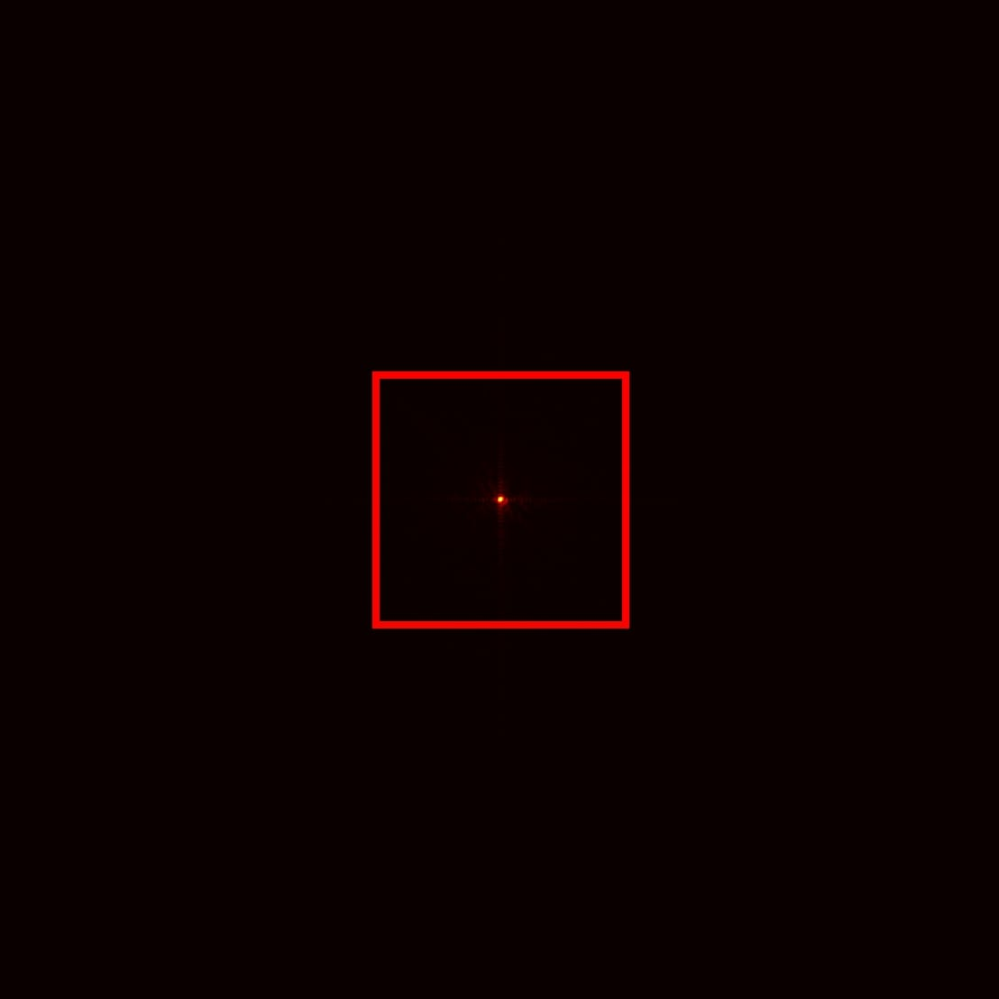
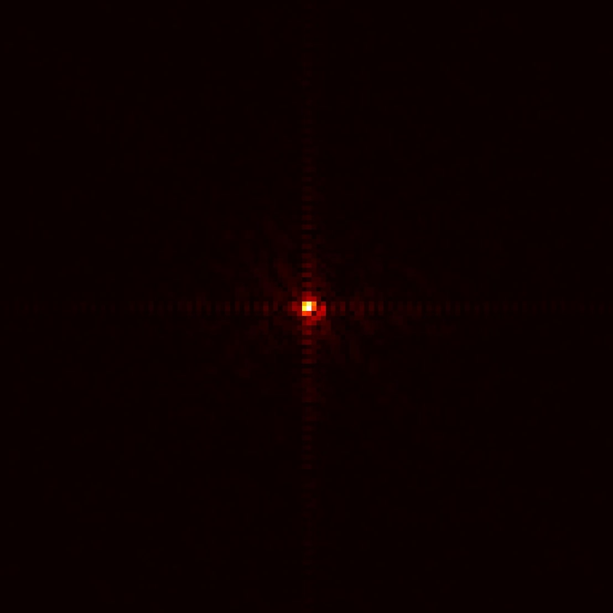

# Ptychography With PFT
Application of the Partial Fourier Transform (PFT) for the ptychography problem.

FFT (512 x 512)            |  PFT (128 x 128)
:-------------------------:|:-------------------------:
 | 

In addition to ptychography experiments utilizing the PFT, this repository provides a PyTorch implementation 
of the PFT found in https://github.com/snudatalab/PFT originally implemented in C++.

This repository also provides a Pytorch implementation of the more recent Auto-MPFT found in 
https://github.com/snudatalab/Auto-MPFT/tree/main originally implemented in C++. However, the experiments in this 
repository make use exclusively of the two-dimensional PFT introduced in the original work.

## Associated Publications

### Fast Partial Fourier Transforms for Large-Scale Ptychography
Full-Paper: https://www.aimsciences.org/article/doi/10.3934/ipi.2025019

Pre-Print: https://arxiv.org/abs/2408.03532

Please cite as

    @misc{parada2024fastpartialfouriertransforms,
         title={Fast Partial Fourier Transforms for Large-Scale Ptychography}, 
         author={Ricardo Parada and Samy Wu Fung and Stanley Osher},
         year={2024},
         eprint={2408.03532},
         archivePrefix={arXiv},
         primaryClass={math.NA},
         url={https://arxiv.org/abs/2408.03532
         }
         
## Set-up

Install all the requirments (designed for python 3.12.7)
```
pip install -r requirements.txt
```

## PFT Demonstration
For a detailed demonstration of the Fast Partial Fourier Transform, refer to [PFT_demo.ipynb](PFT_demo.ipynb).
Technical and theoretical explanations can be found in https://arxiv.org/abs/2008.12559.

## Experiments

### Non-Blind Ptychography
Large-Scale PIE Experiment
```
python PIE_driver.py
```
or
```
python non_blind_experiment_large_scale.py
```

PIE Relative Errors Experiment
```
python nonblind_rel_err_experiments.py
```

### Blind Ptychography
Large-Scale ePIE Experiment
```
python ePIE_driver.py
```
or
```
python ePIE_driver_large_scale.py
```

ePIE Relative Errors Experiment
```
python blind_rel_err_experiments.py
```

## Acknowledgements
Samy Wu Fung was partially funded by National Science Foundation award DMS-2110745. Stanley Osher was partially funded by Air Force Office of Scientific Research (AFOSR) MURI
FA9550-18-502, Office of Naval Research (ONR)
N00014-20-1-2787, and STROBE: a National Science Foundation Science and Technology Center under Grant No. DMR-1548924. Any opinions, findings, and conclusions or recommendations expressed in this material are those of the author(s) and do not necessarily reflect the views of the funding agencies.

We thank Yong-chan Park for his help on setting up the PyTorch-based PFT code.
